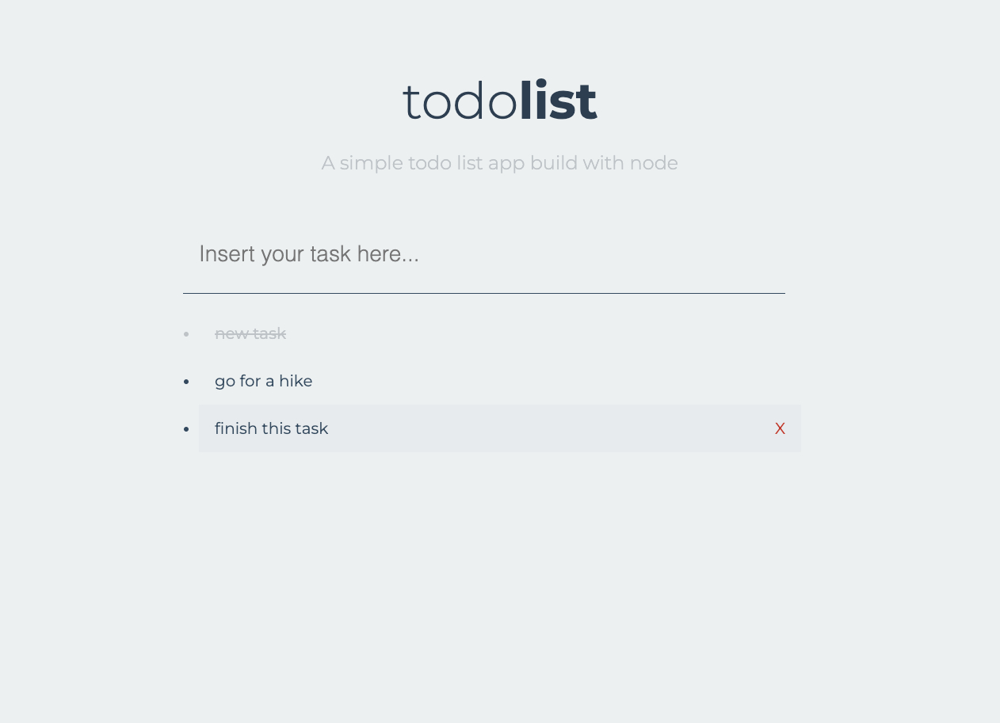

# Simple Todos Api App

## Single page app build using plain JS, API, Node

This is an exercise from The Advanced Webdevelopment course on the Udemy.

It is a single page API app. The front end is plain JS with fetch async and back end is node with express.

[Link to Todo Api App](https://simpletodos-api-app.onrender.com/)

### Screenshot

